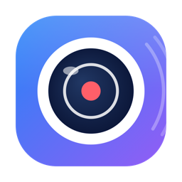

<div align="center">



# MacCam

**Turn your Mac into a private, offline motion-detecting security camera.**

[](https://github.com/polyackiy/MacCam/actions/workflows/ci.yml)
[](LICENSE)


</div>

MacCam lives in your menu bar, watches the camera for motion, and records clips
to a local folder when something moves. It runs **fully offline** — no cloud, no
account, no network code at all — as a lightweight background agent that leans on
the Mac's hardware HEVC encoder to stay easy on CPU and battery.

A free, local-only alternative to subscription surveillance apps.

## Features

- 🎥 **Maximum resolution, automatically** — probes the device and picks the
  largest available format, so the built-in FaceTime camera records at 1080p and
  external USB / Continuity cameras up to 4K with no configuration.
- 🎯 **Flexible triggers** — record **continuously**, on **motion** (downscaled
  `vImage` frame differencing, throttled to ~12 Hz), on **voice** (on-device
  speech detection), or on motion *and* voice. Continuous skips motion analysis
  to save CPU.
- 🔴 **Efficient recording** — HEVC (or H.264) via the hardware encoder, with a
  cooldown after the trigger, seamless clip rotation, and optional pre-roll.
- 🔇 **Audio options** — record sound alongside video, choose the microphone, or
  record **audio only** (no video, saved as `.m4a`) when the camera isn't needed.
- 🗺️ **Detection zones** — paint a 16×9 ignore mask over a **live camera preview**
  to skip busy areas (a swaying tree, a street) and cut false triggers.
- ⏰ **Weekly schedules** — auto start/stop monitoring within a time window, and
  gate recording to its own window (per-weekday, overnight supported). A manual
  Start always takes priority.
- 💽 **Disk-space limits** — cap total clip size and/or keep a minimum amount of
  free space, then **loop** (delete oldest) or **stop & notify**.
- 🛡️ **Guard mode** — start automatically when the screen locks, stop on unlock.
- 🫥 **Discreet mode** — a neutral menu-bar icon that looks identical whether
  idle, monitoring, or recording, so onlookers can't tell the camera is active.
- 🔒 **Private by design** — no network entitlements, no uploads, no telemetry.
  Clips stay in a folder you choose (local disk, external drive, or NAS).
- 🌍 **English & Russian** interface, **launch at login**, and auto-cleanup of
  old clips.

> **Note on privacy indicators:** while the camera is active, macOS shows its own
> green "camera in use" indicator and the hardware LED lights up. This is a system
> anti-spyware feature that no app can disable — MacCam's own icon can be discreet,
> but the OS will still signal that the camera is on.

## Requirements

- macOS 13.0 (Ventura) or newer
- Apple Silicon or Intel Mac with a camera
- Xcode 15+ (to build from source)

## Install

### Download a release

Grab the latest `MacCam-*.dmg` from the
[Releases page](https://github.com/polyackiy/MacCam/releases/latest), open it,
and drag **MacCam** to Applications.

### Build from source

```sh
git clone https://github.com/polyackiy/MacCam.git
cd MacCam
make install        # builds Release and copies MacCam.app to /Applications
```

Or open `MacCam.xcodeproj` in Xcode and run (⌘R).

> **Gatekeeper:** builds are ad-hoc signed, not notarized with an Apple Developer
> ID, so the first launch may be blocked. Right-click the app → **Open**, or run
> `xattr -dr com.apple.quarantine /Applications/MacCam.app`.

On first launch, grant **camera** (and **microphone**, if you enable audio)
access when prompted.

## Usage

1. Click the MacCam menu-bar icon → **Start Monitoring**.
2. When the trigger fires (motion, voice, or always — per your settings), a clip
   records and stops after the cooldown.
3. Clips are saved to `~/Movies/MacCam/` by default (configurable).
4. **Settings…** opens a sidebar window with grouped sections:
   - **Camera** — device, resolution, FPS, audio capture + microphone
   - **Detection** — trigger mode, motion sensitivity + zones, voice sensitivity
   - **Recording** — clip length, cooldown, pre-roll, audio-only, codec/quality
   - **Schedule** — guard mode and the weekly monitoring / recording windows
   - **Storage** — destination folder, usage, auto-cleanup, disk limits
   - **General** — menu-bar icon style and launch-at-login
5. **Open Clips Folder…** reveals your recordings.

## Build & test

```sh
make build     # xcodebuild Release
make test      # run the unit + integration test suite
make lint      # SwiftLint (if installed)
```

## Architecture

A single `AVCaptureSession` feeds a delegate that computes the recording trigger
(motion via `vImage`, and/or voice via on-device `SoundAnalysis`) and drives a
recording state machine writing `AVAssetWriter`. Pure logic (sensitivity and
voice-threshold mapping, format selection, motion diff, trigger mode, ring
buffer, recording FSM, schedules, storage math, file naming) is isolated into
testable seams; AVFoundation/AppKit glue is verified by build + an end-to-end
recording integration test.

See [`docs/ARCHITECTURE.md`](docs/ARCHITECTURE.md) for the full design.

## Contributing

Contributions are welcome! Please read [`CONTRIBUTING.md`](CONTRIBUTING.md) and
our [Code of Conduct](CODE_OF_CONDUCT.md). Found a security issue? See
[`SECURITY.md`](SECURITY.md).

## License

[MIT](LICENSE) © MacCam contributors
